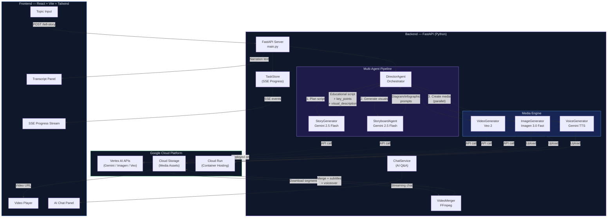
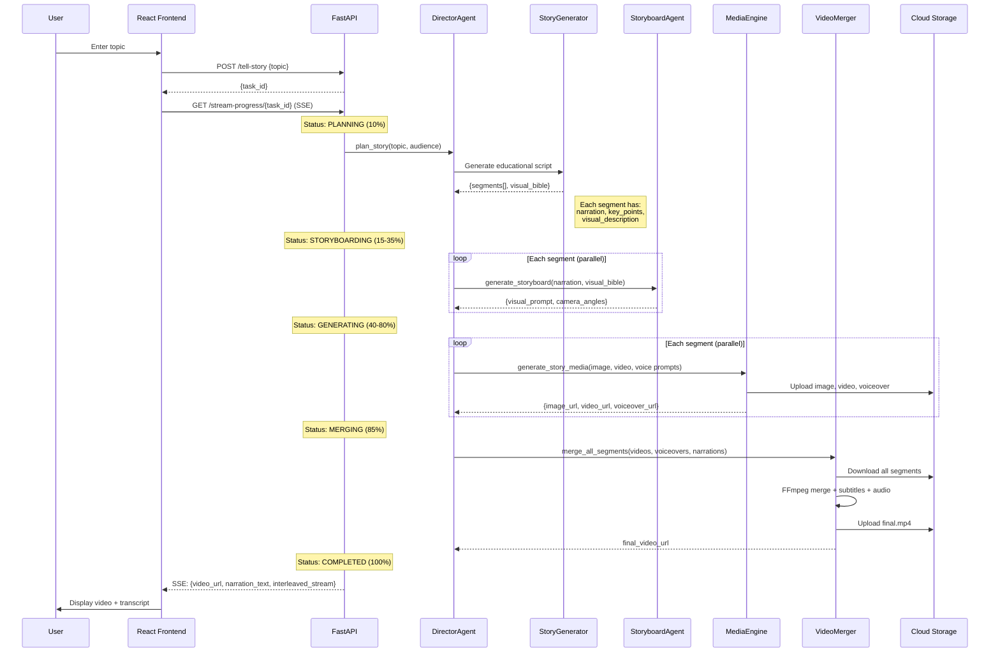
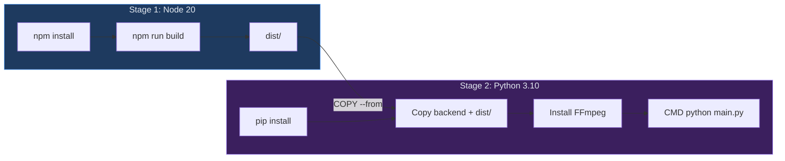

# RAWI Architecture

> Last Updated: 2026-03-15

## System Overview

RAWI is an AI-powered educational video generator built on Google's AI ecosystem. It uses a multi-agent pipeline to transform any topic into a professional explainer video with voiceover, motion graphics, and text overlays.

---

## Architecture Diagram



---

## Data Flow — Video Generation



---

## Component Details

### Frontend (React + Vite)

| Component | File | Purpose |
|-----------|------|---------|
| App | `App.tsx` | Main layout, SSE progress subscription, state management |
| VideoPlayer | `VideoPlayer.tsx` | HTML5 video playback with time tracking |
| TranscriptPanel | `TranscriptPanel.tsx` | Clickable narration segments synced to video |
| ChatPanel | `ChatPanel.tsx` | AI assistant for Q&A about the generated video |

**Key Features:**
- SSE-based real-time progress updates (planning → storyboarding → generating → merging → done)
- Auto-detects dev vs production API URL
- Collapsible right-side panel with Transcript + AI Chat tabs

---

### Backend Agents

| Agent | File | Model | Purpose |
|-------|------|-------|---------|
| **DirectorAgent** | `director_agent.py` | — | Orchestrates the full pipeline: planning → storyboarding → media → merge |
| **StoryGenerator** | `story_generator.py` | Gemini 2.5 Flash | Generates educational scripts with narration, key_points, visual_description per segment |
| **StoryboardAgent** | `storyboard_agent.py` | Gemini 2.5 Flash | Creates visual prompts for infographics, diagrams, and motion graphics |

**Prompt Engineering Highlights:**
- Story prompts request educational explainer content (not fairy tales)
- Each segment includes `key_points` (used for subtitle overlays) and `visual_description` (used for Imagen/Veo prompts)
- Video prompts include **context from the previous segment** for topical continuity
- Storyboard prompts request diagrams, data visualizations, and labeled figures

---

### Media Engine

| Generator | File | Model | Output |
|-----------|------|-------|--------|
| **ImageGenerator** | `media_engine.py` | Imagen 3.0 Fast | Educational infographic images |
| **VideoGenerator** | `media_engine.py` | Veo 2 | Motion graphics video segments (~5s each) |
| **VoiceGenerator** | `media_engine.py` | Gemini TTS | Voiceover narration audio (MP3) |

All three generators run **in parallel** per segment for speed.

---

### Video Merger

| Feature | Implementation |
|---------|---------------|
| **Segment merging** | FFmpeg crossfade transitions between segments |
| **Subtitles** | SRT file with key_points, styled: Arial Bold 28px, semi-transparent background |
| **Voiceover mixing** | Audio delay-aligned per segment, mixed with `amix` |
| **3-tier fallback** | Full merge with audio → video-only with subtitles → simple concat |

---

### TaskStore (SSE Progress)

The backend uses an in-memory `TaskStore` with `asyncio.Queue` to push real-time progress events to the frontend via Server-Sent Events:

```
PENDING (0%) → PLANNING (10%) → STORYBOARDING (15-35%) → GENERATING (40-80%) → MERGING (85%) → COMPLETED (100%)
```

---

## Deployment

### Multi-Stage Docker Build



- **Stage 1**: Node 20 builds the React frontend → outputs `dist/`
- **Stage 2**: Python 3.10-slim with FFmpeg, copies backend code + frontend dist
- FastAPI serves the built frontend as static files from `frontend-react/dist/`

### Cloud Run Deployment

```bash
./infra/setup.sh YOUR_PROJECT_ID us-central1   # Creates GCP resources
./infra/deploy.sh YOUR_PROJECT_ID us-central1  # Builds + deploys
```

**Resources provisioned by `setup.sh`:**
- Service account with Vertex AI + Storage permissions
- Cloud Storage bucket for media assets
- Artifact Registry for Docker images
- Required API enablement

---

## Google Cloud Storage Layout

```
gs://<project>-story-assets/
├── storyboards/          # Imagen-generated infographic images
│   └── <uuid>.png
├── videos/               # Veo-generated video segments
│   └── <uuid>.mp4
├── voiceovers/           # TTS-generated audio narration
│   └── <uuid>.mp3
└── final/                # Merged final videos
    └── <uuid>.mp4
```

---

## Key Design Decisions

| Decision | Rationale |
|----------|-----------|
| **Multi-agent pipeline** | Separation of concerns: story planning, visual prompting, and media generation are independent skills |
| **Parallel media generation** | Image + Video + Voice generated simultaneously per segment for speed |
| **Context overlap in prompts** | Each video prompt includes previous segment context for visual continuity |
| **Key-points-only subtitles** | Full narration plays as voiceover; subtitles show concise bullet points |
| **3-tier FFmpeg fallback** | Graceful degradation: audio merge → video-only → simple concat |
| **SSE with 1s delay** | Ensures the SSE subscriber connects before progress events fire |
| **Multi-stage Docker** | Single container serves both React frontend and Python backend |
| **Shell-script infra** | Fast setup for hackathon, easier to understand than Terraform |
