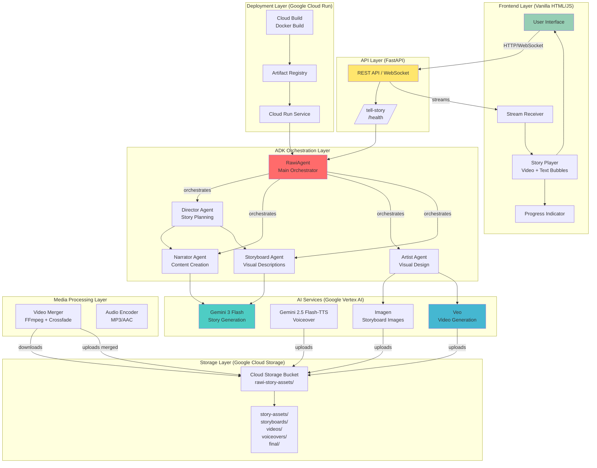
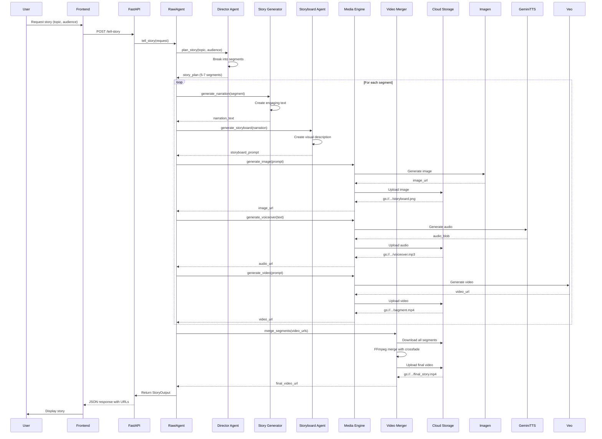
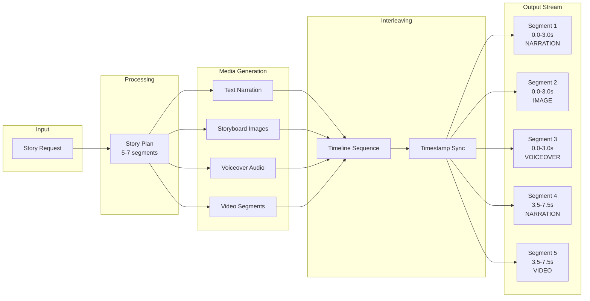

# RAWI Architecture

## Overview

RAWI is built on Google's AI ecosystem, using the Agent Development Kit (ADK) to orchestrate multiple specialized agents that work together to create immersive, multimodal educational stories.

## Architecture Diagram



## Data Flow

### 1. Story Generation Flow



### 2. Interleaved Output Stream



## Component Details

### Frontend Layer

**Responsibilities:**
- User interface for story requests
- Real-time streaming and playback
- Video player with synchronized text bubbles
- Progress tracking

**Technologies:**
- Vanilla HTML5, JavaScript, CSS3
- WebSocket/SSE for streaming
- HTML5 Video API
- Canvas API for overlays

### API Layer

**Responsibilities:**
- RESTful API endpoints
- WebSocket for streaming
- Request validation
- Error handling
- CORS management

**Technologies:**
- FastAPI
- WebSocket support
- Pydantic for validation

### ADK Orchestration Layer

**Responsibilities:**
- Agent coordination
- Tool management
- Context management
- Flow control

**Agents:**
- **RawiAgent**: Main orchestrator
- **DirectorAgent**: Story planning and segmentation
- **NarratorAgent**: Content generation
- **ArtistAgent**: Visual content direction
- **StoryboardAgent**: Visual description generation

### AI Services Layer

**Responsibilities:**
- Story content generation
- Image generation
- Video generation
- Text-to-speech

**Services:**
- Gemini 3 Flash: Story generation
- Imagen: Storyboard illustrations
- Veo: Video sequence generation
- Gemini 2.5 Flash-TTS: Emotive voiceover

### Media Processing Layer

**Responsibilities:**
- Video segment merging
- Audio encoding
- Format conversion
- Transition effects

**Technologies:**
- FFmpeg
- Python subprocess
- Async I/O

### Storage Layer

**Responsibilities:**
- Media asset storage
- URL generation
- Access control
- Lifecycle management

**Structure:**
```
gs://<project>-story-assets/
├── storyboards/
│   ├── <story-id>/frame1.png
│   └── <story-id>/frame2.png
├── videos/
│   ├── <story-id>/segment1.mp4
│   └── <story-id>/segment2.mp4
├── voiceovers/
│   ├── <story-id>/voiceover1.mp3
│   └── <story-id>/voiceover2.mp3
└── final/
    └── <story-id>/final_story.mp4
```

### Deployment Layer

**Responsibilities:**
- Container orchestration
- Auto-scaling
- Load balancing
- Health monitoring

**Technologies:**
- Google Cloud Run
- Docker
- Cloud Build
- Artifact Registry

## Key Design Decisions

### 1. Agent-Based Architecture

**Why:** ADK provides structured agent orchestration with tool integration.

**Benefits:**
- Clear separation of concerns
- Reusable agent components
- Built-in context management
- Tool composition

### 2. Interleaved Output Stream

**Why:** Synchronized multimedia provides more engaging storytelling.

**Benefits:**
- Immersive experience
- Flexible media combinations
- Progressive enhancement
- Accessibility support

### 3. Storyboard-Driven Video Generation

**Why:** Veo works best with detailed visual descriptions.

**Benefits:**
- Consistent visual style
- Better video quality
- Easier iteration
- Reusable assets

### 4. Cloud-Native Deployment

**Why:** Google Cloud provides managed services for AI and storage.

**Benefits:**
- Automatic scaling
- Pay-per-use pricing
- Integrated AI services
- Global availability

### 5. Shell Script Deployment

**Why:** Faster setup for hackathon, easier to understand than Terraform.

**Benefits:**
- Quick setup
- Easy debugging
- Transparent operations
- Lower complexity

## Performance Considerations

### Latency Optimization

- Parallel processing of independent segments
- Caching of generated assets
- Streaming responses to frontend
- Pre-warming Cloud Run instances

### Cost Optimization

- Use of Cloud Run (serverless)
- Efficient video merging
- Asset lifecycle policies
- CDN integration for delivery

### Scalability

- Stateless API design
- Horizontal scaling on Cloud Run
- Async processing pipeline
- Queue-based work distribution

## Security Considerations

### Authentication

- Service account authentication
- API key management
- IAM role-based access
- Signed URLs for assets

### Data Privacy

- No user data persistence
- Temporary asset storage
- Encrypted storage at rest
- HTTPS/TLS in transit

## Monitoring & Observability

### Metrics

- Story generation latency
- API response times
- Media generation success rates
- Resource utilization

### Logging

- Structured logs (JSON)
- Stackdriver integration
- Error tracking
- Performance traces

### Alerts

- API health failures
- Generation timeouts
- Storage quota limits
- Error rate thresholds

## Future Enhancements

### Planned Features

- [ ] Real-time voice input
- [ ] Interactive story branches
- [ ] Multi-language support
- [ ] Custom character voices
- [ ] AR/VR integration
- [ ] Offline story viewing
- [ ] Story analytics
- [ ] Collaboration features

### Technical Improvements

- [ ] GraphQL API
- [ ] Redis caching layer
- [ ] Event-driven architecture
- [ ] Kubernetes deployment option
- [ ] Terraform IaC
- [ ] CI/CD pipeline
- [ ] Automated testing
- [ ] Performance profiling

---

**Last Updated**: 2025-02-25
