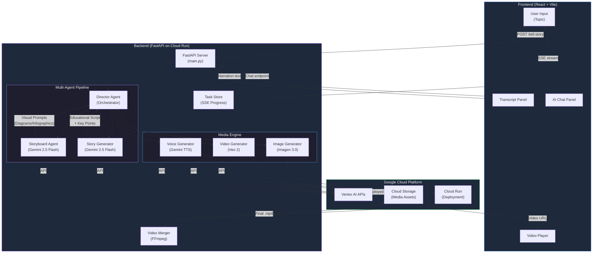

# RAWI — AI Educational Video Generator

> **RAWI** (Arabic for "Storyteller") transforms any topic into a professional educational explainer video using Google's AI ecosystem — Gemini, Imagen, Veo, and Cloud TTS — all orchestrated through a multi-agent pipeline.

---

## 🏗️ Architecture Diagram



---

## ⚡ Quick Start (Run Locally in 5 Minutes)

### Prerequisites

| Tool | Version | Check |
|------|---------|-------|
| Python | 3.10+ | `python --version` |
| Node.js | 18+ | `node --version` |
| FFmpeg | any | `ffmpeg -version` |
| Google Cloud SDK | any | `gcloud --version` |
| Git | any | `git --version` |

### Step 1: Clone the repo

```bash
git clone https://github.com/loaiwalid07/Rawi.git
cd Rawi
```

### Step 2: Set up Google Cloud credentials

```bash
# Login and set your project
gcloud auth login
gcloud auth application-default login
gcloud config set project YOUR_PROJECT_ID

# Enable required APIs
gcloud services enable aiplatform.googleapis.com
gcloud services enable storage.googleapis.com
gcloud services enable texttospeech.googleapis.com
```

### Step 3: Create a `.env` file

```bash
# Copy and edit the environment file
cp .env.example .env
```

Edit `.env` with your values:

```env
# Required
GOOGLE_CLOUD_PROJECT=your-gcp-project-id
GEMINI_API_KEY=your-gemini-api-key

# Storage (a GCS bucket for media assets)
STORAGE_BUCKET_NAME=your-project-story-assets

# Optional
LOCAL_OUTPUT_DIR=./output
PORT=8000
```

### Step 4: Install Python dependencies

```bash
# Create virtual environment
python -m venv .venv

# Activate it
# Windows:
.venv\Scripts\activate
# macOS/Linux:
source .venv/bin/activate

# Install packages
pip install -r requirements.txt
```

### Step 5: Install frontend dependencies

```bash
cd frontend-react
npm install
cd ..
```

### Step 6: Run the app

Open **two terminals**:

**Terminal 1 — Backend:**
```bash
python main.py
```
The backend starts at `http://localhost:8000`

**Terminal 2 — Frontend:**
```bash
cd frontend-react
npm run dev
```
The frontend starts at `http://localhost:5173`

### Step 7: Generate a video

1. Open `http://localhost:5173` in your browser
2. Type a topic (e.g., "How photosynthesis works")
3. Watch the progress bar as RAWI generates your educational video
4. View the final video with narration transcript in the sidebar

---

## 🎯 How It Works

```
User enters topic → Director Agent plans educational script
    → Story Generator creates narration + key points (Gemini 2.5 Flash)
    → Storyboard Agent generates visual descriptions for diagrams/infographics
    → Media Engine generates assets in parallel:
        • Imagen 3.0 → educational infographic images
        • Veo 2 → motion graphics video segments
        • Gemini TTS → voiceover narration audio
    → Video Merger (FFmpeg) combines everything:
        • Video segments with crossfade transitions
        • Voiceover audio mixed in
        • Subtitle overlays with key points
    → Final .mp4 delivered to the user
```

---

## 🛠️ Tech Stack

| Component | Technology | Purpose |
|-----------|------------|---------|
| **Orchestration** | Google ADK (Agent Development Kit) | Multi-agent coordination |
| **Script Generation** | Gemini 2.5 Flash | Educational narration & key points |
| **Storyboarding** | Gemini 2.5 Flash | Visual prompt engineering |
| **Images** | Imagen 3.0 Fast | Infographics, diagrams, charts |
| **Video** | Veo 2 | Motion graphics & animated visuals |
| **Voiceover** | Gemini TTS | Natural voice narration |
| **Video Processing** | FFmpeg | Merging, transitions, subtitles |
| **Backend** | FastAPI + Uvicorn | REST API + SSE streaming |
| **Frontend** | React + Vite + Tailwind | Modern responsive UI |
| **Storage** | Google Cloud Storage | Media asset hosting |
| **Deployment** | Google Cloud Run | Serverless container hosting |

---

## 📁 Project Structure

```
Rawi/
├── main.py                         # FastAPI app + RawiAgent orchestrator
├── requirements.txt                # Python dependencies
├── Dockerfile                      # Container config for Cloud Run
├── .env.example                    # Environment template
│
├── app/
│   ├── director_agent.py           # Orchestrates story planning
│   ├── story_generator.py          # Gemini → educational scripts
│   ├── storyboard_agent.py         # Gemini → visual descriptions
│   ├── media_engine.py             # Imagen + Veo + TTS integration
│   ├── video_merger.py             # FFmpeg merging + subtitles
│   └── chat_service.py             # AI chat about generated video
│
├── frontend-react/
│   ├── src/
│   │   ├── App.tsx                 # Main UI with video + sidebar
│   │   └── components/
│   │       ├── VideoPlayer.tsx     # Video playback
│   │       ├── TranscriptPanel.tsx # Narration transcript
│   │       └── ChatPanel.tsx       # AI assistant chat
│   └── package.json
│
├── infra/
│   ├── setup.sh                    # GCP project setup
│   └── deploy.sh                   # Deploy to Cloud Run
│
└── tests/
    ├── conftest.py
    └── unit/
```

---

## 🚀 Deploy to Google Cloud Run

```bash
# One-command deployment
./infra/setup.sh YOUR_PROJECT_ID us-central1
./infra/deploy.sh YOUR_PROJECT_ID us-central1

# Or manually:
gcloud builds submit --tag gcr.io/YOUR_PROJECT_ID/rawi
gcloud run deploy rawi \
  --image gcr.io/YOUR_PROJECT_ID/rawi \
  --platform managed \
  --region us-central1 \
  --allow-unauthenticated \
  --memory 2Gi \
  --timeout 600
```

---

## 📡 API Reference

### `POST /tell-story`

Start generating an educational video. Returns a `task_id` for progress tracking.

```bash
curl -X POST http://localhost:8000/tell-story \
  -H "Content-Type: application/json" \
  -d '{"topic": "How photosynthesis works", "audience": "general", "duration_minutes": 2}'
```

**Response:** `{"task_id": "uuid-here"}`

### `GET /stream-progress/{task_id}`

SSE stream of real-time progress updates.

```
planning (10%) → storyboarding (15-35%) → generating (40-80%) → merging (85%) → completed (100%)
```

### `GET /health`

Health check. Returns `{"status": "healthy"}`.

---

## 🔧 Troubleshooting

| Problem | Solution |
|---------|----------|
| `Vertex AI API Error` | Run `gcloud services enable aiplatform.googleapis.com` |
| `Permission denied on GCS` | Ensure service account has `roles/storage.objectAdmin` |
| `FFmpeg not found` | Install FFmpeg and ensure it's on your PATH |
| `Video generation timeout` | Reduce `duration_minutes` or check API quotas |
| `Frontend can't connect` | Verify backend is running on port 8000 |

---

## 📄 License

MIT License — see [LICENSE](LICENSE) for details.

---

**RAWI — Where Every Topic Becomes a Visual Story** 🎬✨
